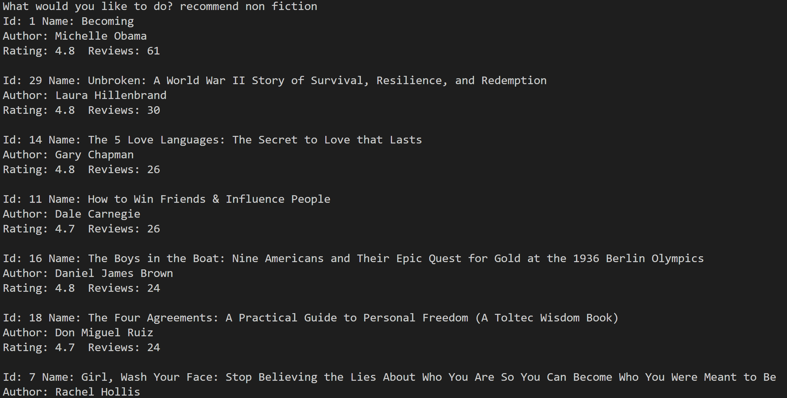
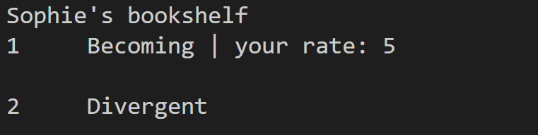
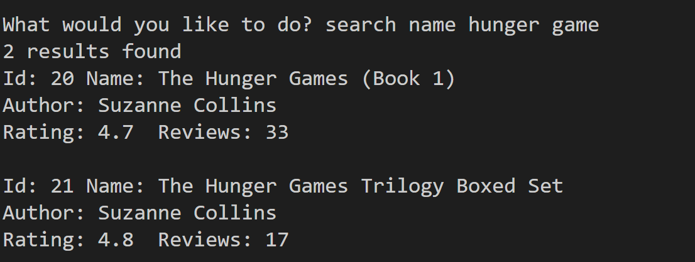

## What is Find Your Book   
This app prototype enables users to discover and explore books of interest, share their ratings and comments, and create personalized bookshelves. 

### Project Flow 
 

### Key Points  
1. It provides a comprehensive display of book details, including basic info and feedback from other users. 
   
2. The app's recommendation lists and book details are dynamically updated as more users share their  ratings and comments.   
    
3. Users have the ability to customize their bookshelves according to their preferences. 
    
4. The app displays multiple search results to provide users with a variety of options.
    

### Need to improve 
1. In view of the time constraints, some features such as saving bookshelf data have been omitted. As a result, when users return to the app, they will not be able to access their saved bookshelves.
2. The app lacks user login/register functionality to differentiate new and existing users, and it also does not provide a password setting feature. 
   
### Data Source 
The original data was from Kaggle open data source, data used in this project has been cleaned by myself. 
link: https://www.kaggle.com/datasets/sootersaalu/amazon-top-50-bestselling-books-2009-2019 

### Requirements 
Before run the project, make sure you have already installed pandas and openpyxl libraries. 
``` python 
pip install pandas 
pip install openpyxl 
``` 
Then run the run.py file, the project will be launched.